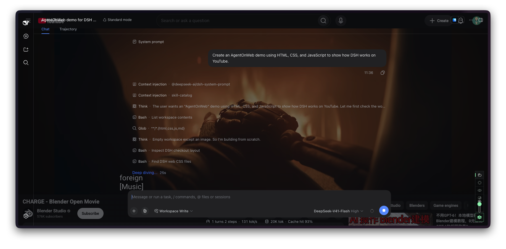

# AgentOnWeb

**[English](README.md)** · **[简体中文](README.zh-CN.md)**

**Use Codex on the website you're already using.**

Code while watching a video or reading documentation. AgentOnWeb brings Codex into your browser, shows your running sessions, and notifies you when a task finishes or needs approval. Click a session to jump straight back to it.

## Get started

For **macOS + Chrome**. Have [Node.js 22.19+](https://nodejs.org/en/download) and Codex installed and signed in.

### 1. Install the extension

[**Get AgentOnWeb from the Chrome Web Store**](https://chromewebstore.google.com/detail/agentonweb/lhbmeokjjcmklamnepcechnpcdjgkcoe)

### 2. Set up your terminal

Run this once in your Mac's Terminal:

```sh
curl -fsSL https://raw.githubusercontent.com/HeftyKoo/AgentOnWeb/main/scripts/install.sh | bash
```

The installer sets up the local terminal, automatic startup, Chrome connection and Codex notifications. Existing Codex settings are preserved.

### 3. Start Codex on any website

Open a website and click AgentOnWeb. In its terminal, enter your project directory and start Codex:

```sh
cd ~/your-project
codex
```

For session notifications, open `/hooks` in Codex, review and trust **AgentOnWeb session status**, then start a new Codex session. You only need to do this once for the installed hooks.

## Keep coding, keep your page

- **Chill:** keep the website visible behind Codex; adjust the transparency to suit you.
- **Focus:** give Codex an opaque workspace.
- **Watch:** return to the website while Codex keeps running.

Double-tap **Option** in Chill to interact with the website, then double-tap again to return. Open multiple terminal tabs for different projects. Session notifications take you back to the right tab; approve requests there in Codex.

| Shortcut on macOS | Action |
| --- | --- |
| `Control+0` | Show or hide AgentOnWeb |
| `Control+1 / 2 / 3` | Chill / Focus / Watch |
| `` Control+` `` | Switch workspaces |

You can change extension shortcuts in Chrome's settings.

## Also works with DeepSeek Harness

Prefer DSH? Connect its conversations, models and tools alongside Codex, and switch between them from the dock. See the [DSH setup guide](docs/dsh.md).

[](https://www.youtube.com/watch?v=s083RpD38HU)

**DSH demo:** [English](https://www.youtube.com/watch?v=s083RpD38HU) · [中文](https://www.youtube.com/watch?v=DV8s9z-w4GE)

## Help

[Setup and troubleshooting](docs/one-command-setup.md) · [Terminal guide](packages/terminal-host/README.md) · [Report an issue](https://github.com/HeftyKoo/AgentOnWeb/issues) · [Privacy](https://heftykoo.github.io/AgentOnWeb/privacy.html)

[Development](docs/development.md) · [Changelog](CHANGELOG.md)
