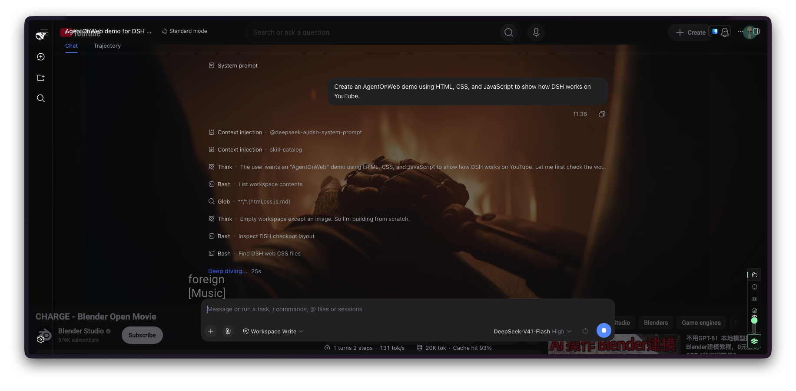

# AgentOnWeb

**[English](README.md)** · **[简体中文](README.zh-CN.md)**

**把本机终端带到你正在使用的网页上。**

AgentOnWeb 在当前网页上显示本机工作区。你可以一边看视频、查阅文档，一边使用 Shell、运行 `codex` 等已安装的命令行工具，再切回网页；切换视图不会停止命令。

当前源码提供两条独立连接：

- **Local terminal（本机终端）**：Shell 进程运行在你的电脑上，通过 Web 终端显示和交互。直接输入 `cd`，使用 Shell 的补全、历史和别名，运行已安装的 CLI。退出 CLI 后返回同一 Shell。它会新建由本机服务管理的 Shell，不会镜像已有的 Terminal.app 窗口。
- **DeepSeek Harness（DSH）**：显示 DSH 自带的 Web 工作区，保留会话、工具、审批、模型和插件界面。

已发布扩展和 DSH 插件属于此前的 DSH 版本。**本机终端目前需要从本仓库构建扩展，并安装本地打包的终端服务。** 终端服务尚未发布到 npm。终端实机验收覆盖 macOS 和 Chrome；Firefox、Safari 构建通过，但终端实机交互及 Windows/Linux 运行仍待验收。

| 模式 | 功能 |
| --- | --- |
| **Chill（轻松）** | 半透明工作区，背景透明度可调。 |
| **Focus（专注）** | 为同一工作区切换不透明背景。 |
| **Watch（观看）** | 隐藏工作区，正常使用网页，保留 dock 便于返回。 |

切换模式或隐藏面板不会停止本机进程。在 Chill 下双击 **Option / Alt** 切换到网页交互，再次双击返回工作区。

## 开始使用本机终端

在 macOS 安装 **Node.js 22.19+** 和 **pnpm 11.5.0**，然后运行：

```sh
git clone https://github.com/HeftyKoo/AgentOnWeb.git
cd AgentOnWeb
pnpm install
pnpm --filter @agentonweb/terminal-host pack --pack-destination "$PWD/release"
npm install -g ./release/agentonweb-terminal-host-0.1.0.tgz
pnpm build:extension
aow service install
```

1. 在 Chrome 打开 `chrome://extensions`，启用**开发者模式**，选择**加载已解压的扩展程序**，载入本仓库的 `apps/extension/.output/chrome-mv3`。
2. 打开普通网站，点击 dock 的 **+** 查找工作区，选择 **Local terminal**，如出现连接按钮则点击 **Connect**。
3. 在 `aow service install` 打开的私有设置标签页中，点击 **Allow connection**。需要重新打开时运行 `aow service open`。
4. 返回网页，直接使用 Shell：

   ```sh
   cd ~/你的项目
   codex
   ```

Codex 只是使用示例，并非终端服务的依赖。请自行安装和配置所需 CLI。Shell 加载你自己的启动文件；工具使用本机凭据和权限，AgentOnWeb 不替你选择模型或覆盖 CLI 权限。

终端工具栏的 **+** 新建 Shell，选择器切换终端，**×** 在确认后关闭所选终端。多个标签页可以查看同一个 Shell，点击 **Control here** 转移输入控制权。刷新或关闭浏览器视图不会结束进程；停止服务、退出系统登录或重启电脑会结束正在运行的 Shell。

macOS 服务随登录启动。需要前台运行时使用 `aow terminal` 并保持进程运行。安装、撤销授权、更新服务和平台限制见[本机终端指南](packages/terminal-host/README.md)。

## 连接 DSH

DSH 为可选功能，与本机终端独立连接。你需要 **Node.js 22.19+**、DeepSeek Harness，以及在 DSH 内配置好的模型服务商凭据。仓库固定的 DSH 兼容基线记录在 [release-contract.json](release-contract.json)。

```sh
npm install -g @deepseek-ai/dsh@0.1.2-alpha.3
dsh plugin --profile web add @agentonweb/dsh-surface@0.1.2
dsh web
```

保持 `dsh web` 运行，安装或更新插件后重启它。在 AgentOnWeb 中点击 dock 的 **+**，选择 **DeepSeek Harness**，然后在 DSH 页面批准 **Allow connection**。切换 DSH 与本机终端不会停止其中任意一个。

模型凭据保存在 DSH 中。在 **DSH Settings → AgentOnWeb → Revoke connection** 撤销浏览器授权。Safari 可能请求本地工作区和会话存储权限，请按照提示操作。

## 日常操作

通过 dock 切换 Chill、Focus、Watch 或已连接的工作区，并调整 Chill 透明度。关闭面板或点击扩展工具栏图标可隐藏面板，dock 可以重新打开它。

| 操作 | macOS | Windows / Linux |
| --- | --- | --- |
| 显示或隐藏 AgentOnWeb | `Control+0` | `Alt+0` |
| Chill / Focus / Watch | `Control+1 / 2 / 3` | `Alt+1 / 2 / 3` |
| Terminal ↔ DSH | `` Control+` `` | `` Alt+` `` |
| 在 Chill 下切换工作区与网页交互 | 双击 `Option` | 双击 `Alt` |

浏览器快捷键可能优先于终端按键。可在浏览器设置中调整扩展快捷键。支持普通 HTTP(S) 网页；扩展设置等受保护页面无法承载工作区。

## DSH 版本：商店与视频

以下商店链接和视频对应已发布的 DSH 使用流程。本机终端请使用上方源码安装步骤。

| 浏览器 | 商店安装 |
| --- | --- |
| Chrome | [Chrome 应用商店](https://chromewebstore.google.com/detail/agentonweb/lhbmeokjjcmklamnepcechnpcdjgkcoe) |
| Firefox | [Firefox 附加组件](https://addons.mozilla.org/en-US/firefox/addon/agentonweb/) |
| Safari | 仓库尚未提供公开商店链接。 |

[](https://www.youtube.com/watch?v=s083RpD38HU)

**演示：**[中文](https://www.youtube.com/watch?v=DV8s9z-w4GE) · [English](https://www.youtube.com/watch?v=s083RpD38HU)

**DSH 安装教程：**[中文](https://www.youtube.com/watch?v=kyeRpiG3asg) · [English](https://www.youtube.com/watch?v=CIfW76WAcwA)

## 开发

执行 `pnpm install` 后，为所用浏览器构建并载入扩展：

| 浏览器 | 构建命令 | 输出目录 |
| --- | --- | --- |
| Chrome 132+ | `pnpm build:extension` | `apps/extension/.output/chrome-mv3` |
| Firefox 140+ | `pnpm build:extension:firefox` | `apps/extension/.output/firefox-mv2` |
| Safari 18.4+ | `pnpm build:extension:safari` | `apps/extension/.output/safari-mv2` |

Firefox 在 `about:debugging#/runtime/this-firefox` 使用**临时载入附加组件**，选择输出目录中的 `manifest.json`。Safari 启用开发者功能后使用**添加临时扩展**。包含扩展的 macOS 应用参见 [Safari 构建指南](apps/safari/README.md)。

开发终端时，先运行 `pnpm --filter @agentonweb/terminal-host build`，再运行 `node packages/terminal-host/lib/cli.js terminal`。同一用户的状态目录只能由一个终端服务占用；已安装并运行的服务会占用它。停止或更新含活动 Shell 的服务前，请参阅本机终端指南。

开发 DSH 插件时，`pnpm install:dsh-surface` 构建并安装本仓库版本到 DSH 的 Web profile，然后重启 `dsh web`。

```sh
pnpm check
pnpm release:audit
```

`check` 运行仓库检查、TypeScript、测试和浏览器构建。`release:audit` 额外验证扩展、DSH 插件和终端安装包可重复构建，并隔离安装终端包、验证真实 Shell。交互变更应使用真实扩展和对应工作区验证，构建通过不等于浏览器实机验收。

离线演示可运行 `pnpm build:preview` 和 `pnpm preview`；演示不会执行命令。实现与打包细节见[架构说明](docs/architecture.md)和[发布指南](docs/releasing.md)。

[报告问题](https://github.com/HeftyKoo/AgentOnWeb/issues) · [隐私政策](https://heftykoo.github.io/AgentOnWeb/privacy.html)

### 快捷键作用范围

表格显示默认按键。显示/隐藏与模式快捷键只通过浏览器扩展命令执行；如果与终端应用冲突，可在浏览器的扩展快捷键设置中改绑或清除。网页和 iframe 不再另行拦截数字模式键。

运行时切换键在嵌入的 Terminal / DSH 输入区中保留。宿主网页上仅在工作区启用或控制面板展开时处理，并放行网页的可编辑输入区域；隐藏的工作区不能转发切换操作。单独打开的原生运行时页面不拦截该键。超过两个运行时时，按面板显示顺序循环切换。

Firefox 在 Linux 上使用 Alt+数字切换浏览器标签页，需要在扩展快捷键设置中另选绑定；这不是 Windows / macOS Firefox 的统一行为。

### Codex 会话状态与通知

点击页面图标可查看 Codex 会话列表，点击会话或通知可打开对应的 terminal tab。任务完成、需要权限审批时会出现页面通知；批准或拒绝仍在原生 Codex 终端中完成。首次运行 `aow codex-hooks install`，在 Codex `/hooks` 中审查并信任这些 hooks，再在更新后的 Host 新建的终端中启动 Codex。详见[接入步骤、事件链路与边界](docs/agent-notifications.md)。

## 一键配置（macOS + Chrome）

新安装入口 `aow setup` 自动配置本机服务、Chrome 配对桥接和 Codex 通知。全局 npm 安装在允许安装脚本时自动执行；推荐发布时提供统一 shell 安装器。Codex 首次 hooks 信任仍需用户确认。终端包和安装器尚未发布。详见[一键配置（macOS + Chrome）](docs/one-command-setup.md).

**安装会修改的内容：**启动当前用户的登录常驻服务、注册 Chrome 原生消息桥接、备份并更新 Codex hooks/notify。可用 `AOW_SKIP_SETUP=1` 跳过自动配置。卸载前请先结束终端工作，执行 `aow uninstall`，再执行 `npm uninstall -g @agentonweb/terminal-host`；服务中的终端会停止，用户设置、CLI 历史与备份会保留。
